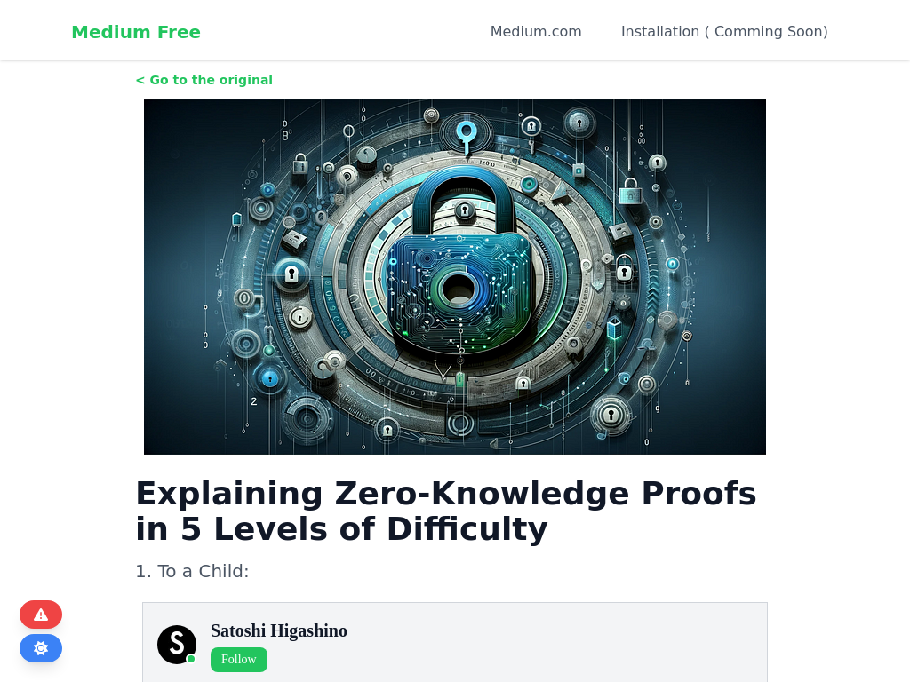

# medium-free
Chrome extension to read medium articles for free



# Methods to use
Currently there is two methods to use it and they are
* Bookmarklet
* Chrome Extension

# Bookmarklet
* Create New Bookmark and Name anything you want ( for e.g Medium Free Bookmarklet )
* In url add following code
  
  ```javascript
  javascript:(function(){
    if(window.location.hostname == "medium.com"){
        window.location.href = `https://medium-free.vercel.app/read?url=${window.location.href}`;
    }else{
        alert("Please make sure you're onto medium.com post/article.")
    }})();

* Visit Medium's Article and On Adress Bar Search For Bookmark Name ( for e.g Medium Free Bookmarklet )
* You'll be redirected to url without paywall
